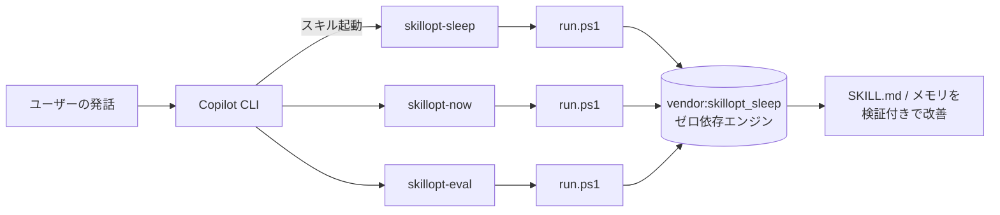

# 作業報告書: SkillOpt を Copilot CLI スキル化

> 最終更新日: 2026-06-26

## 目次

1. [この作業の目的](#1-この作業の目的)
2. [前提知識（やさしい解説）](#2-前提知識やさしい解説)
3. [最初の課題](#3-最初の課題)
4. [調査でわかったこと](#4-調査でわかったこと)
5. [採用した設計](#5-採用した設計)
6. [成果物の一覧](#6-成果物の一覧)
7. [動作検証の結果](#7-動作検証の結果)
8. [既知の制約](#8-既知の制約)
9. [今後の発展案](#9-今後の発展案)

---

## 1. この作業の目的

SkillOpt（スキル文書を自動で改善する仕組み）を、**GitHub Copilot CLI からそのまま呼び出せるスキル**に
仕立てることが目的です。さらに、出来上がったスキルを 1 つのフォルダにまとめ、初心者でも導入できる
手順書を添えてリポジトリに残します。

---

## 2. 前提知識（やさしい解説）

- **Copilot CLI**: ターミナルで動く GitHub Copilot。チャットでコードや作業を手伝ってくれます。
- **スキル（Skill）**: Copilot CLI に「得意技」を追加する仕組み。フォルダの中の `SKILL.md` という
  テキストに「どんなときに・何をするか」を書いておくと、Copilot がその場面で自動的に使います。
- **SkillOpt**: スキル文書そのものを「学習対象」とみなし、**良くなった変更だけを採用する**手法。
  AI の重み（モデル内部の数値）は一切変えず、テキストだけを賢くしていきます。
- **SkillOpt-Sleep**: SkillOpt を日々の利用に応用した companion。過去の作業を振り返り、
  夜間などに自動でスキルを磨きます。

> たとえるなら——「作業マニュアル（SKILL.md）を、実際の成績を見ながら少しずつ書き直し、
> テストで点が上がったときだけ正式採用する」仕組みです。

---

## 3. 最初の課題

最初に作った 5 つのスキルは **手順書（ドキュメント）だけ**で、肝心のスクリプトを実際には
実行できませんでした。理由は次の 3 点です。

| 問題 | 内容 |
|---|---|
| パスが仮置き | スキル内のリポジトリパスがプレースホルダで、実在を保証できない。 |
| 実行場所に依存 | `python -m skillopt_sleep` は「リポジトリの中」でしか動かない前提だった。 |
| 実行部品がない | スクリプトを呼び出す仕組みがスキルに同梱されていなかった。 |

つまり「使い方は書いてあるが、ボタンを押しても動かない」状態でした。

---

## 4. 調査でわかったこと

実機で確認した結果、自己完結化が可能だと判明しました。

- SkillOpt-Sleep のエンジン（`skillopt_sleep/`）は **約 245KB・32 ファイル**と軽量。
- 外部ライブラリ（openai / azure / yaml）の読み込みは **すべて関数内の遅延 import**。
  → 既定の `mock`（費用ゼロ）モードは **Python 標準ライブラリだけで動作**する。
- `PYTHONPATH`（Python の探索先）を通すだけで、リポジトリの外からでも実行できた。
- 一方、研究用の `train.py` / `eval_only.py` は numpy 等のビルド済み部品・データセット・API キーが
  必要で、**完全な同梱は不可能**。

---

## 5. 採用した設計

ユーザー要望「スキルフォルダに全部まとめたい」に沿って、以下の方針を採りました。

### 5-1. エンジンの同梱（vendoring）

ゼロ依存のエンジン `skillopt_sleep/` を `skillopt-sleep/vendor/` に丸ごとコピー。
出所の追跡用に `VERSION.txt`（元コミット SHA）を記録します。

### 5-2. 実行ランナー `run.ps1`

各スキルに PowerShell スクリプト `run.ps1` を同梱。役割は次の 3 つです。

1. Python 3.10 以上を自動で探す。
2. 同梱エンジン（vendor）を `PYTHONPATH` に設定する。
3. 受け取った引数をエンジンへそのまま渡す。

これにより **「どのフォルダから呼んでも動く」** ようになりました。

### 5-3. エンジンは 1 か所だけ

同梱エンジンは `skillopt-sleep/vendor/` に 1 部だけ置き、`skillopt-now` と `skillopt-eval` は
それを参照します（コピーの重複を避け、更新箇所を一本化）。

---

## 6. 成果物の一覧

| スキル | 役割 | 同梱物 | 自己完結 |
|---|---|---|---|
| `skillopt-sleep` | 過去作業から自動改善（夜間バッチ向き） | `vendor/`, `run.ps1`, `sync-vendor.ps1` | ✅ 完全 |
| `skillopt-now` | 今すぐ 1 回最適化 | `run.ps1` | ✅ 完全 |
| `skillopt-eval` | スキルの品質をスコア化 | `run.ps1` | ✅ Quick / ⚠️ Benchmark |
| `skillopt-new-skill` | スキルをゼロから作成 | （ツール不要） | ✅ |
| `skillopt-train` | ベンチマークでフル学習 | `run.ps1` | ⚠️ 要リポジトリ + 依存 |

各フォルダの中身: `SKILL.md`（手順本体）、`.skill-meta.json`（メタ情報）、必要に応じて `run.ps1`。

---

## 7. 動作検証の結果

2 つの層で検証し、いずれも成功しました。

### レイヤー 1: 実行エンジン（run.ps1 を直接実行）

| 検証 | 結果 |
|---|---|
| 決定的証明 `--proof`（API キー不要） | ✅ PASS（held-out **0.333 → 1.000**、有害な変更はゲートが却下） |
| 本物の最適化サイクル `run → adopt` | ✅ SKILL.md が実際に進化（2 ルール追加・バックアップ生成） |
| `skillopt-train -ListConfigs` | ✅ リポジトリ自動解決・設定一覧表示 |
| 依存パッケージ不足時 | ✅ `exit 2` でセットアップを案内 |

### レイヤー 2: Copilot CLI からのスキル発見

新しい Copilot セッションを立ち上げて確認しました。

- ✅ 5 つのスキルすべてが利用可能スキル一覧に表示された。
- ✅ そのセッションから `--proof` を実行し、`PASS`（held-out 0.3333 → 1.0）を確認。

> 補足: スキルは Copilot CLI の **起動時**に読み込まれます。作成後に使うには、新しい
> セッションを開く（または `/clear` する）必要があります。

---

## 8. 既知の制約

- **Copilot CLI セッションの自動ハーベスト（収集）は未保証**。元の収集機能は Claude / Codex の
  履歴向けです。Copilot 環境では、まず `mock` モード・タスクファイル指定・`--proof` を使ってください。
- **`skillopt-train` と `skillopt-eval` の Benchmark モードは自己完結できません**。numpy 等の
  ビルド済み部品、データセット、API キーが別途必要です。手順書に明記しています。
- **同梱エンジンはスナップショット**です。本体が更新されたら `sync-vendor.ps1` で再同期します。
- **対応 OS**: ランナーは PowerShell（Windows）向けです。

---

## 9. 今後の発展案

- Copilot CLI のセッション履歴を読む専用ハーベスタを追加し、本当の意味で「自分の作業から学ぶ」を実現。
- macOS / Linux 向けの `run.sh` を追加し、クロスプラットフォーム化。
- `sync-vendor.ps1` を定期実行し、同梱エンジンを自動で最新化。
